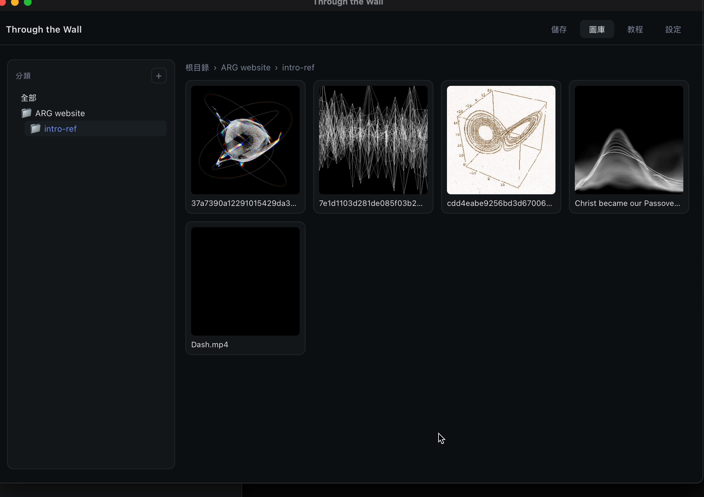

# Through the Wall

> A local Mac/Windows app for saving images, videos, GIFs, Reels, and Stories from
> Instagram, Pinterest, Twitter/X, TikTok, and hundreds of other sites — even when
> the platform hides the download button.



一個本地端的小工具，可以把 IG 貼文/Reels/Stories、Pinterest pin、Twitter 圖/影片，
以及 yt-dlp / gallery-dl 支援的其他幾百個站的媒體存到自己電腦上，並用**巢狀分類資料夾**
管理收藏。沒有雲端、沒有帳號，所有檔案都在你自己的硬碟。

---

## Features

- **Paste URL → preview → pick items → save**. IG carousels show every image with
  individual checkboxes; Reels/Stories are detected automatically.
- **Nested category folders** (e.g. `reference/fashion/streetwear`) with
  autocomplete and recent-categories chips.
- **Built-in library view** — browse, search, rename, move (drag-drop or right-click),
  multi-select with `⌘+click` / `shift+click` / rectangle drag, batch delete or move.
- **IG login-required content works** — cookies are read directly from your
  logged-in Chrome profile, no manual export.
- **VP9 → H.264 auto-transcode** so IG Reels play in QuickTime out of the box
  (requires ffmpeg; see below).
- **Native app**, no browser tab, no terminal window.

## Installation (macOS)

1. Download the latest `Through the Wall.dmg` from
   [Releases](./releases) (or build one yourself — see below).
2. Open the DMG and drag the app into **Applications**.
3. First launch: right-click the app → **Open** → **Open**. macOS asks this once
   for unsigned apps; after that you can launch normally.
4. Install [ffmpeg](https://ffmpeg.org/) if you don't have it yet
   (needed for video transcoding):
   ```
   brew install ffmpeg
   ```

## Installation (Windows)

Currently requires a build from source. See the
[Build from source](#build-from-source) section below. Requires:

- Chrome (logged in to the sites you want to save from)
- [ffmpeg](https://www.gyan.dev/ffmpeg/builds/) on `PATH`

## Usage

1. Copy a URL from Instagram, Pinterest, Twitter, TikTok, etc.
2. Open Through the Wall → paste into the input → **抓取 (Fetch)**.
3. Check the items you want, edit the filename if needed, type or pick a category,
   then **儲存 (Save)**.
4. Files land in `~/Desktop/through-the-wall/<category>/`. You can change the save
   path in the **設定 (Settings)** tab.

Tips:

- Click anywhere on a preview card to toggle selection.
- In the library, single-click selects, double-click reveals in Finder,
  right-click opens a context menu, drag on empty space to marquee-select.
- Hover over a recent-category chip to reveal an **×** button to forget it.

## Build from source

```bash
git clone https://github.com/slflai/through-the-wall
cd through-the-wall
python3 -m venv .venv
.venv/bin/pip install -r requirements.txt

# Dev mode (opens the app from Python, leaves a terminal window open)
./run.command              # macOS
run.bat                    # Windows

# Packaged .app (macOS)
.venv/bin/pip install pyinstaller Pillow dmgbuild
.venv/bin/python scripts/make_icon.py
.venv/bin/pyinstaller ThroughTheWall.spec --noconfirm
xattr -cr "dist/Through the Wall.app"
codesign --force --deep --sign - "dist/Through the Wall.app"
./make-dmg.sh              # outputs dist/Through the Wall.dmg
```

For Windows `.exe`, run the same PyInstaller step on a Windows machine — the
`.spec` file has a platform switch that handles it.

## How it works

- **URL parsing** is delegated to
  [`gallery-dl`](https://github.com/mikf/gallery-dl) (image-heavy sites like
  IG / Pinterest) and [`yt-dlp`](https://github.com/yt-dlp/yt-dlp)
  (video-heavy sites like TikTok / YouTube).
- **Cookies** come from the user's Chrome profile via each tool's built-in
  `--cookies-from-browser chrome` flag, so login-gated content works without any
  manual cookie export.
- **IG Reels/Stories videos** are re-encoded to H.264 + AAC MP4 after download so
  they play in QuickTime Player — IG serves VP9 streams that macOS can't decode
  natively.
- **UI** is plain HTML/CSS/JS loaded by [pywebview](https://pywebview.flowrl.com/)
  in a native window; the Python API class is exposed to JS via pywebview's
  bridge.

## Tech stack

- [pywebview](https://github.com/r0x0r/pywebview) — native window around the HTML UI
- [yt-dlp](https://github.com/yt-dlp/yt-dlp) — video extraction and download
- [gallery-dl](https://github.com/mikf/gallery-dl) — image / gallery extraction
- [browser-cookie3](https://github.com/borisbabic/browser_cookie3) — thumbnail fetching with session cookies
- [PyInstaller](https://pyinstaller.org/) + [dmgbuild](https://dmgbuild.readthedocs.io/) — packaging

## License

[MIT](./LICENSE) — do what you want, no warranty.

## Acknowledgements

This app is basically a friendly wrapper around two incredible open source
projects: **yt-dlp** and **gallery-dl**. All credit for the hard work of keeping
up with platform API changes goes to their maintainers. If this tool is useful
to you, please go star those repos too.
